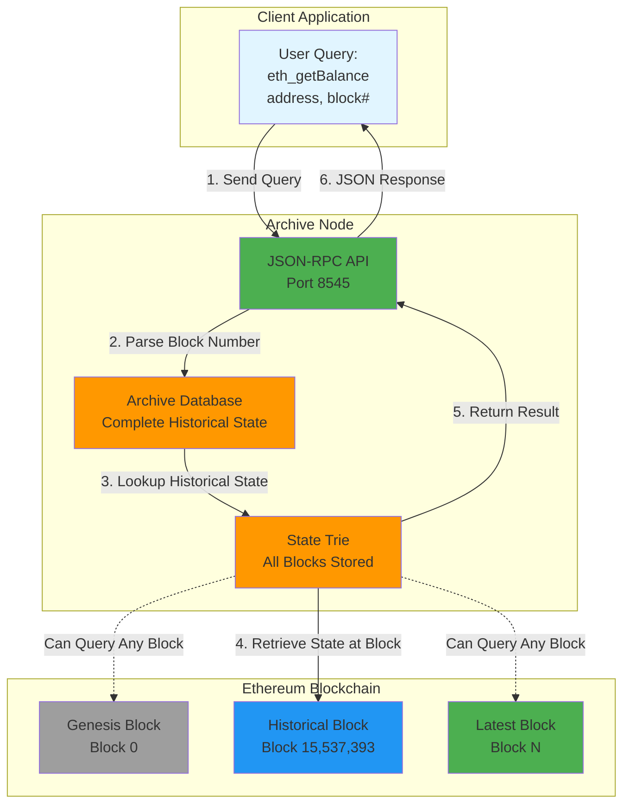

# Ethereum Archive Node: Development & Production SRE Challenge

This repository demonstrates both **local development** of an Ethereum Archive Node and a **production-grade operational plan** for deploying it on Azure VMs with enterprise tooling.

---

## Ethereum Mainnet Archive Node

This setup runs a full Ethereum mainnet archive node with complete historical data access.

### Tech Stack
*   **Execution Client**: [Geth](https://geth.ethereum.org/) (Archive Mode, Full Sync)
*   **Consensus Client**: [Prysm](https://docs.prylabs.network/) (Beacon Chain)
*   **Orchestration**: Docker Compose
*   **Monitoring**: Prometheus + Grafana
*   **Network**: Ethereum Mainnet (Chain ID: 1)

### Quick Start

**Prerequisites:**
*   Docker & Docker Compose
*   `curl` (for testing)
*   **Minimum 2TB SSD** for full archive node (sync can take days/weeks)
*   **16GB+ RAM** recommended

**Launch the Archive Node:**
```bash
# 1. Start all services
docker-compose up -d

# 2. Monitor Geth sync progress
docker-compose logs -f geth

# 3. Check Prysm beacon chain sync
docker-compose logs -f prysm
```

**Important Notes:**
*   **Initial sync takes days/weeks** - The node will download the entire Ethereum blockchain history
*   **Archive mode requires ~2-3TB** of disk space
*   **Monitor sync progress** using `eth_syncing` JSON-RPC call
*   The node will be fully functional once synced, but queries work during sync

**Test the Node:**

*Check Sync Status:*
```bash
# Linux/Mac
curl -X POST -H "Content-Type: application/json" --data '{"jsonrpc":"2.0","method":"eth_syncing","params":[],"id":1}' http://localhost:8545

# Windows PowerShell
Invoke-RestMethod -Uri http://localhost:8545 -Method POST -ContentType "application/json" -Body '{"jsonrpc":"2.0","method":"eth_syncing","params":[],"id":1}'
```

*Query Account Balance (Example: Vitalik's address):*

*Linux/Mac (bash):*
```bash
# Query account balance via JSON-RPC (returns hex value in wei)
# Uses "latest" which means the highest block your node has synced so far
curl -X POST -H "Content-Type: application/json" --data '{"jsonrpc":"2.0","method":"eth_getBalance","params":["0xd8dA6BF26964aF9D7eEd9e03E53415D37aA96045", "latest"],"id":1}' http://localhost:8545

# Convert hex balance to readable ETH
curl -X POST -H "Content-Type: application/json" --data '{"jsonrpc":"2.0","method":"eth_getBalance","params":["0xd8dA6BF26964aF9D7eEd9e03E53415D37aA96045", "latest"],"id":1}' http://localhost:8545 | python3 -c "import sys, json; result = json.load(sys.stdin)['result']; print(f'Balance: {int(result, 16) / 10**18} ETH')"
```

*Windows PowerShell:*
```powershell
# Query account balance via JSON-RPC (returns hex value in wei)
# Uses "latest" which means the highest block your node has synced so far
Invoke-RestMethod -Uri http://localhost:8545 -Method POST -ContentType "application/json" -Body '{"jsonrpc":"2.0","method":"eth_getBalance","params":["0xd8dA6BF26964aF9D7eEd9e03E53415D37aA96045", "latest"],"id":1}'

# Convert hex balance to readable ETH
$response = Invoke-RestMethod -Uri http://localhost:8545 -Method POST -ContentType "application/json" -Body '{"jsonrpc":"2.0","method":"eth_getBalance","params":["0xd8dA6BF26964aF9D7eEd9e03E53415D37aA96045", "latest"],"id":1}'; $hex = $response.result -replace '^0x', ''; $balance = [System.Numerics.BigInteger]::Parse($hex, [System.Globalization.NumberStyles]::AllowHexSpecifier) / [System.Numerics.BigInteger]::Parse('1000000000000000000'); Write-Host "Balance: $balance ETH"
```

*Note: The result is returned in hex format (wei). To convert to ETH, divide by 10^18.*

**Monitoring Dashboard:**
1. Open Grafana at [http://localhost:3000](http://localhost:3000) (admin/admin)
2. Dashboards are **auto-provisioned**:
   - **Geth Dashboard** (Execution Layer metrics)
   - **Prysm Validator Dashboard** (Consensus Layer metrics)

# Inspecting Archive Queries

The main benefit of an archive node is **quick access to historical state queries** at any block in Ethereum's history. Regular nodes can only query recent state, but archive nodes can instantly answer questions about any historical block.

## Archive Node Query Flow



## Step 1: Check Available Blocks

Before querying historical blocks, check what blocks are available in your node:

### Option A: Check in Grafana Dashboard

1. Open Grafana at [http://localhost:3000](http://localhost:3000) (admin/admin)
2. Navigate to the **Geth Dashboard**
3. Look at the **"Latest Block Number"** panel - this shows the highest block your node has synced
4. You can query any block from **0 (genesis)** up to this number

### Option B: Query Current Block via JSON-RPC

*Linux/Mac (bash):*
```bash
# Get the current latest block number
curl -X POST http://localhost:8545 -H "Content-Type: application/json" -d '{"jsonrpc":"2.0","method":"eth_blockNumber","params":[],"id":1}'
```

*Windows PowerShell:*
```powershell
# Get the current latest block number
Invoke-RestMethod -Uri http://localhost:8545 -Method POST -ContentType "application/json" -Body '{"jsonrpc":"2.0","method":"eth_blockNumber","params":[],"id":1}'
```

*The result is in hex format. Convert to decimal to see the actual block number (e.g., `0x1234` = 4660).*

## Step 2: Query Historical State at Available Blocks

Once you know your available block range, query historical state. **Replace `BLOCK_NUMBER` with a block number within your synced range.**

### Example: Query ETH Balance at Historical Block

**What was the ETH balance of account `0xd8dA6BF26964aF9D7eEd9e03E53415D37aA96045` at a specific block?**

*Linux/Mac (bash):*
```bash
# Replace BLOCK_NUMBER with a hex block number (e.g., "0x1000" for block 4096, or "latest" for current)
curl -X POST http://localhost:8545 -H "Content-Type: application/json" -d '{"jsonrpc":"2.0","method":"eth_getBalance","params":["0xd8dA6BF26964aF9D7eEd9e03E53415D37aA96045", "latest"],"id":1}'

# Query a specific historical block (example: block 1000 = 0x3e8)
curl -X POST http://localhost:8545 -H "Content-Type: application/json" -d '{"jsonrpc":"2.0","method":"eth_getBalance","params":["0xd8dA6BF26964aF9D7eEd9e03E53415D37aA96045", "0x3e8"],"id":1}'
```

*Windows PowerShell:*
```powershell
# Replace BLOCK_NUMBER with a hex block number or use "latest" for current
Invoke-RestMethod -Uri http://localhost:8545 -Method POST -ContentType "application/json" -Body '{"jsonrpc":"2.0","method":"eth_getBalance","params":["0xd8dA6BF26964aF9D7eEd9e03E53415D37aA96045", "latest"],"id":1}'

# Query a specific historical block (example: block 1000 = 0x3e8)
Invoke-RestMethod -Uri http://localhost:8545 -Method POST -ContentType "application/json" -Body '{"jsonrpc":"2.0","method":"eth_getBalance","params":["0xd8dA6BF26964aF9D7eEd9e03E53415D37aA96045", "0x3e8"],"id":1}'
```

*Note: Use `"latest"` for the current block, `"0x0"` for genesis block, or any hex block number within your synced range (check Grafana first!).*

### Example: Query Token Balance at Historical Block

**What was the token balance at a specific historical block?**

*Linux/Mac (bash):*
```bash
# Query contract storage at a specific block
# Replace BLOCK_NUMBER with a hex block number within your synced range
# Example: Query USDC balance at block 1000 (0x3e8)
curl -X POST http://localhost:8545 -H "Content-Type: application/json" -d '{"jsonrpc":"2.0","method":"eth_getStorageAt","params":["0xA0b86991c6218b36c1d19D4a2e9Eb0cE3606eB48", "0x0", "0x3e8"],"id":1}'
```

*Windows PowerShell:*
```powershell
# Query contract storage at a specific block
# Replace BLOCK_NUMBER with a hex block number within your synced range
Invoke-RestMethod -Uri http://localhost:8545 -Method POST -ContentType "application/json" -Body '{"jsonrpc":"2.0","method":"eth_getStorageAt","params":["0xA0b86991c6218b36c1d19D4a2e9Eb0cE3606eB48", "0x0", "0x3e8"],"id":1}'
```

*Note: This queries contract storage. For ERC-20 token balances, you typically need to call the contract's `balanceOf` function, not direct storage access.*

## Step 3: Verify Archive Mode (Query Any Historical Block)

Query any block from your synced range to verify archive mode is working:

*Linux/Mac (bash):*
```bash
# Query a specific block (replace 0x3e8 with a block number from your synced range)
curl -X POST http://localhost:8545 -H "Content-Type: application/json" -d '{"jsonrpc":"2.0","method":"eth_getBlockByNumber","params":["0x3e8", true],"id":1}'

# Query genesis block (always available)
curl -X POST http://localhost:8545 -H "Content-Type: application/json" -d '{"jsonrpc":"2.0","method":"eth_getBlockByNumber","params":["0x0", true],"id":1}'
```

*Windows PowerShell:*
```powershell
# Query a specific block (replace 0x3e8 with a block number from your synced range)
Invoke-RestMethod -Uri http://localhost:8545 -Method POST -ContentType "application/json" -Body '{"jsonrpc":"2.0","method":"eth_getBlockByNumber","params":["0x3e8", true],"id":1}'

# Query genesis block (always available)
Invoke-RestMethod -Uri http://localhost:8545 -Method POST -ContentType "application/json" -Body '{"jsonrpc":"2.0","method":"eth_getBlockByNumber","params":["0x0", true],"id":1}'
```

**Important:** 
- **Check Grafana first** to see your current block number
- Only query blocks **within your synced range** (0 to your latest block)
- Archive nodes can query any block instantly, but you can only query blocks that have been synced
- Use `"latest"` to query the most recent synced block


**Note:** On Ethereum mainnet, blocks are produced every 12 seconds. The archive node stores complete historical state, allowing queries to any block from genesis to the latest block.

---
# References & Inspiration

*   [Google SRE Book](https://sre.google/sre-book/) - SLOs, error budgets, on-call practices
*   [Ethereum Archive Node Guide](https://www.cherryservers.com/blog/ethereum-archive-node) - Hardware benchmarks
*   [Geth Documentation](https://geth.ethereum.org/docs) - Official Geth docs
*   [Lighthouse Book](https://lighthouse-book.sigmaprime.io/) - Lighthouse consensus client
*   [Archive Node Docker Guide](https://medium.com/@amirpanah.mohammad2/a-step-by-step-guide-how-to-install-an-ethereum-archive-node-with-docker-53764b74f4fd) - Deployment Example

