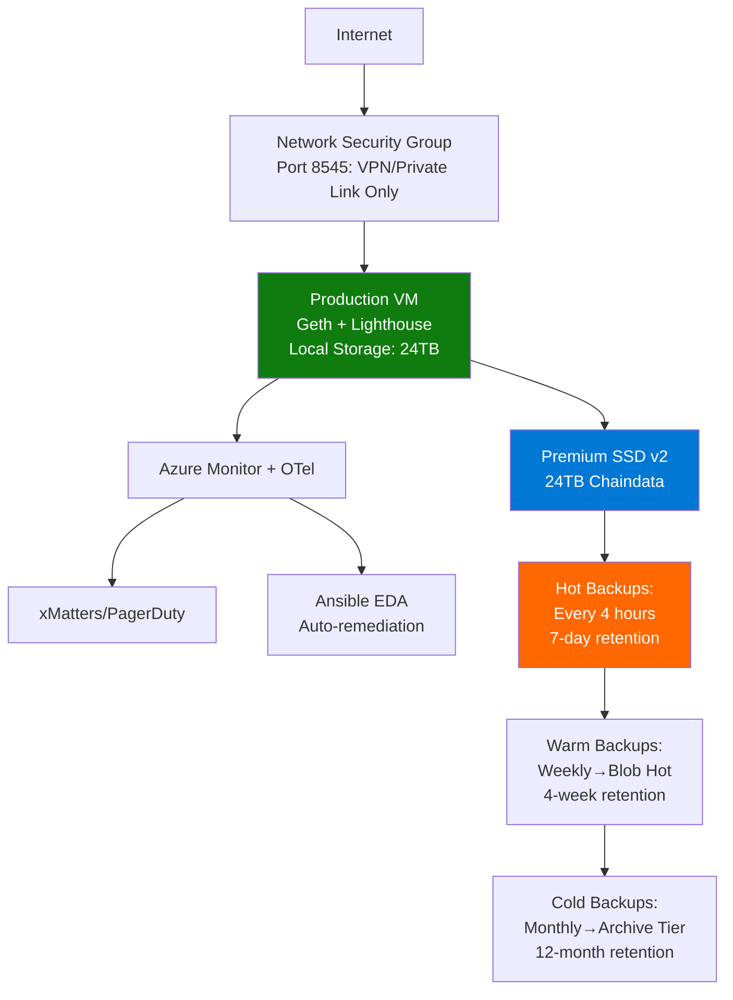

# Production Operational Plan
## Ethereum Archive Node Deployment on Azure

**Target Infrastructure**: Azure Virtual Machines  
**Use Case**: High-performance archive node for historical blockchain queries  
**Criticality**: Query performance, storage capacity, availability  
**Reference Architecture**: Based on [Cherry Servers Archive Node Guide](https://www.cherryservers.com/blog/ethereum-archive-node)

---

## 1. Infrastructure Architecture

### 1.1 Compute & Storage Design
We're deploying a **single high-performance Azure VM** with scheduled maintenance windows (industry standard for archive nodes):

**VM Configuration:**
- **Instance Type**: Lsv3-series (80 vCPU, 640 GB RAM, local NVMe SSDs)
- **OS**: Ubuntu 22.04 LTS with kernel tuning (sysctl: file descriptors, network buffers)
- **Architecture**: 1 Production VM (active 24/7)

**Storage Strategy:**
- **Primary Storage**: Azure Premium SSD v2 (3x 8TB disks in RAID 0 = 24TB usable, initial deployment)
  - **Why RAID 0 initially?** Azure LRS (Locally Redundant Storage) already provides 3 replicas at the storage layer, plus we have 4-hourly snapshots; RAID 0 maximizes performance and capacity
  - **Why Local?** Archive nodes are I/O-intensive; direct SSD gives <0.5ms latency
  - Premium SSD v2 delivers 80,000 IOPS per disk, perfect for historical queries
  - **Future Migration**: After performance testing, can migrate to RAID 5 (16TB usable) or RAID 6 (8TB usable) via mdadm for additional fault tolerance if needed
  - RAID configuration: Software RAID using Linux mdadm within the VM
- **OS Disk**: 256GB Premium SSD for system files
- **Capacity Planning**: As of 2025, archive nodes require 14-16TB; we provision 24TB with RAID 0 (or 16TB with RAID 5 post-migration)

**High Availability Strategy:**
- **99.9% SLO** = 43 minutes downtime/month
- **Scheduled Maintenance**: Monthly compaction window (announced 48 hours in advance)
  - Typical schedule: First Saturday of month, 2-8 AM UTC
- **Rapid Recovery**: Automated snapshots every 4 hours enable 30-minute RTO

**Why Single VM?**
- Archive nodes aren't latency-critical (forensics, analytics, compliance queries)
- Most crypto companies (Etherscan, Chainalysis, etc.) use single nodes with good backups
- Users accept scheduled maintenance for archive access
- **Cost savings: ~$2,300/month** vs. dual-VM setup

### 1.2 Network Architecture


---

## 2. DevOps Pipeline & Automation

### 2.1 CI/CD Flow (GitHub Actions)
**Deployment Trigger**: Git push to `main` branch or manual workflow dispatch

**Pipeline Stages:**
1. **Binary Acquisition**: Download Geth/Lighthouse from official sources
2. **Security Scan**: Upload to **JFrog Artifactory** → **Xray** scans for CVEs
3. **Infrastructure Provisioning**: **Terraform** provisions Azure resources
4. **Configuration Management**: **Ansible** deploys binaries and configures services
5. **Health Validation**: Automated checks (block sync status, peer count, RPC availability)

**GitHub Actions Workflow Example:**
```yaml
name: Deploy Ethereum Archive Node
on:
  workflow_dispatch:
    inputs:
      environment:
        description: 'Target environment'
        required: true
        default: 'production'

jobs:
  deploy:
    runs-on: ubuntu-latest
    steps:
      - name: Terraform Provision
        run: |
          cd terraform/
          terraform apply -auto-approve
      
      - name: Ansible Configure
        run: |
          ansible-playbook -i inventory/azure.yml playbooks/deploy.yml
```

### 2.2 Infrastructure as Code (Terraform)
**Modules:**
- `network.tf`: VNet, NSG (P2P ports 30303/9001 open, RPC 8545 restricted to VPN/Private Link)
- `compute.tf`: VM provisioning with Azure Managed Identity for Vault access
- `storage.tf`: Premium SSD v2 disk attachment (12TB for chaindata)
- `secrets.tf`: Key Vault integration (initial bootstrap secrets)

**Key Terraform Outputs:**
- VM IP address (private, for Ansible inventory)
- Premium SSD v2 disk resource ID

### 2.3 Configuration Management (Ansible)
**Playbooks:**
- `bootstrap.yml`: User creation, kernel tuning, disk formatting
- `deploy_binaries.yml`: Download from **Artifactory**, verify checksums, install to `/opt/ethereum/`
- `configure_services.yml`: Systemd units for Geth/Lighthouse, JWT secret from **Vault**
- `patch_security.yml`: Security-only updates scheduled during compaction window

**Ansible + Vault Integration:**
```yaml
- name: Fetch JWT secret from Vault
  azure.azure_azcollection.azure_rm_keyvault_secret_info:
    vault_uri: "{{ vault_url }}"
    secret_name: "ethereum-jwt"
  register: jwt_secret
```

---

## 3. Security Posture

**Binary Supply Chain:**
- All binaries stored in **JFrog Artifactory** (private repository)
- **Xray** scans binaries for vulnerabilities pre-deployment
- Deployment blocked if high/critical CVEs detected

**Secrets Management:**
- **HashiCorp Vault** (or Azure Key Vault) for:
  - JWT token (Geth ↔ Lighthouse Engine API authentication)
  - SSH keys for Ansible
  - Service Principal credentials for Terraform
- VMs authenticate via **Azure Managed Identity** (no static credentials)
- **Terraform State**: Stored in Azure Storage with state locking and encryption enabled

**Access Control & Hardening:**
- **SSH Hardening**: Key-only authentication, root login disabled, fail2ban enabled for brute-force protection
- **Azure RBAC**: Terraform service principal has Contributor scope; Ansible has VM Contributor only (principle of least privilege)
- **Azure Bastion**: Zero public IPs; all SSH access via Bastion jump host
- **API Rate Limiting**: Nginx reverse proxy limits JSON-RPC to 100 req/min per IP to prevent abuse

**Network Security:**
- NSGs: Default deny, explicit allow for P2P (30303/9001) and management (SSH via Bastion)
- RPC endpoint (8545) **not** exposed to internet; accessible via Azure Private Link or VPN
- **Azure DDoS Protection Standard**: Protection against volumetric attacks on P2P ports
- **Peer Restriction**: Geth `--netrestrict` limits P2P to trusted CIDR ranges (optional for extra security)

**Data Security:**
- Disk encryption at rest (Azure platform-managed keys or customer-managed in Key Vault)
- **Backup Verification**: Quarterly DR drills to test restore procedures; checksums validated after backup creation

**Audit & Compliance:**
- **Azure Security Center/Defender for Cloud**: Continuous security posture monitoring and vulnerability scanning
- **auditd**: Logs all SSH sessions and file access to `/data/geth` for compliance (GDPR, SOC2)
- **Immutable Audit Logs**: Azure Log Analytics with retention locks (7-year retention for financial compliance)
- **Security Incident Response**: Playbook for VM compromise scenarios; Azure Sentinel for SIEM/threat detection

---

## 4. Monitoring & Observability

### 4.1 Metrics Collection
**Infrastructure Monitoring (Azure Monitor + OpenTelemetry):**
- **OTel Collector** on each VM forwards:
  - System metrics (CPU, RAM, disk I/O, network) via Node Exporter
  - Custom disk metrics (IOPS, latency, throughput) for NFS mount
  - Logs from systemd journals

**Application Monitoring (Prometheus + Exporters):**
- **Geth**: Built-in Prometheus endpoint (`:6060/debug/metrics/prometheus`)
  - Metrics: `eth_blockNumber`, `eth_db_chaindata_size`, `p2p_peers`, `txpool_pending`
- **Lighthouse**: Beacon metrics (`:5054/metrics`)
  - Metrics: `beacon_head_slot`, `validator_participation_rate`, `sync_eth2_fallback_connected`
- **Systemd Exporter**: Service uptime, restart counts, failure rates

**Query Performance Tracking:**
- OpenTelemetry **traces** on JSON-RPC requests
- Indexed by `method` (e.g., `eth_getTransactionReceipt`), `block_number`, `response_time`
- Stored in **Azure Application Insights** with custom dimensions for fast querying

### 4.2 Dashboards
- **Grafana** (self-hosted or Grafana Cloud) with data sources:
  - Azure Monitor (infra metrics)
  - Prometheus (app metrics)
- **Key Panels**: Block height delta (vs. mainnet head), query p99 latency, disk usage trend, peer count

---

## 5. Incident Response & Automation

### 5.1 Alerting Strategy
**Critical Alerts** (Page via **xMatters/PagerDuty**):

---

**Critical Alerts** (Page via **xMatters/PagerDuty**):
- Node down >5 minutes (systemd service failed, VM crash)
- Disk usage >85% on NFS volume (risk of write failures)
- Block sync stalled >1 hour (falling behind mainnet)
- Query p99 latency >10s (degraded user experience)

**Warning Alerts** (Slack notification):
- High CPU usage >80% sustained
- Low peer count <20
- High memory usage >90%

### 5.2 Self-Healing Automation
**Ansible Event-Driven Automation (EDA):**
- Listens to Azure Monitor webhooks
- Auto-executes remediation playbooks

**Example Rules:**
```yaml
# rulebook.yml
- name: Auto-restart on service failure
  condition: event.alert == "geth.service failed"
  action:
    run_playbook: playbooks/restart_geth.yml

- name: Clear cache on high memory
  condition: event.alert == "high_memory"
  action:
    run_playbook: playbooks/clear_txpool_cache.yml
```

**Alternative**: Azure Automation Runbooks with webhooks for auto-remediation

---

## 6. Disaster Recovery & Backup Strategy

### 6.1 Backup Tiers
**Hot Backups** (Azure Managed Disk Snapshots):
- Frequency: Every 4 hours (automated via Azure Policy)
- Retention: 7 days (42 snapshots)
- RTO: 30 minutes (create new VM, attach snapshot)
- Cost: ~$40/month (incremental snapshots)

**Warm Backups** (Azure Blob - Hot Tier):
- Frequency: Weekly full backup (tar + AzCopy upload)
- Retention: 4 weeks
- Process: Stop services → tar chaindata → upload → restart (5-6 hours total)
- RTO: 8 hours (download + extract + sync catch-up)
- Cost: ~$200/month

**Cold Backups** (Azure Blob - Archive Tier):
- Frequency: Monthly
- Retention: 12 months (compliance/forensics)
- RTO: 24-48 hours (rehydration from Archive tier)
- Cost: ~$10/month

### 6.2 Geographic Redundancy
- **Primary Region**: East US
- **DR Region**: West US 2 (Geo-redundant Blob Storage replication)
- **Failover**: Terraform provisions new VM in DR region, restores from latest Warm backup, updates DNS
- **RPO**: 7 days (weekly backup cadence)

---

## 7. Cost Management & Green SRE

### 7.1 FinOps Strategy
**Compute Optimization:**
- **Reserved Instance**: 1-year commitment for VM (~40% savings)
- **Single VM**: Eliminates redundant compute costs

**Storage Tiering:**
- Premium SSD v2 RAID 5 (3x 8TB = 14TB usable): ~$1,800/month
- Warm backups: Blob Hot tier ~$250/month
- Cold archives: Blob Archive tier ~$12/month

**Monitoring Costs:**
- Azure Monitor: Use Log Analytics ingestion cap (~$150/month)
- Prometheus: Self-hosted on VM

### 7.2 Green SRE Practices
- **Carbon-Aware Scheduling**: Run compaction during low-carbon grid hours
- **Right-Sizing**: Quarterly review; downgrade if CPU/RAM <50%
- **Query Caching**: Redis layer reduces redundant RPC calls

---

## 8. Operational Runbook

### 8.1 Compaction Procedure (Scheduled Maintenance)
**Trigger**: Disk fragmentation >20% OR first Saturday of each month

**Communication**:
- **48 hours before**: Email users about maintenance window
- **Maintenance Window**: First Sat of month, 2-8 AM UTC
- **Status Page**: Update status.yourcompany.com

**Automated Procedure** (`playbooks/compact_scheduled.yml`):
1. **Pre-check**: Verify disk usage, peer count, sync status
2. **Announce Downtime**: Post to status page via API
3. **Stop Services**:
   ```bash
   systemctl stop geth lighthouse-beacon lighthouse-validator
   ```
4. **Run Compaction**:
   ```bash
   geth snapshot prune-state --datadir /data/geth
   # Takes 4-6 hours for 12TB dataset
   ```
5. **Restart Services**:
   ```bash
   systemctl start geth lighthouse-beacon lighthouse-validator
   ```
6. **Sync Verification**: Wait for node to sync to chain head (~20-30 min)
7. **Clear Maintenance**: Remove status page announcement
8. **Duration**: 5-7 hours total; **Planned downtime** = acceptable for archive nodes

**Emergency Rollback**: If compaction fails, restore from most recent Hot Backup (30 min RTO)

### 8.2 Patching Strategy
**Security Patching** (Automated):
- **Ansible playbook** (`patch_security.yml`) applies security-only patches; reboots scheduled during compaction window (quarterly).
- **Azure Update Manager**: Centralized patch orchestration and compliance reporting across all VMs from Azure Portal.

**Client Upgrades** (Quarterly):
- Download new Geth/Lighthouse → Artifactory → Xray scan → deploy during maintenance window.

---

## 9. SRE & DevOps Culture

### 9.1 Deployment Philosophy
**One-Click Deploy**: GitHub Actions workflow orchestrates Terraform + Ansible  
**Immutable Infrastructure**: VMs are cattle, not pets; recreate vs. repair  
**Everything as Code**: Zero manual SSH; all changes via Git commits  

### 9.2 On-Call Practices
- **Follow-the-Sun**: 24/7 coverage across time zones
- **Blameless Postmortems**: Root cause analysis after incidents
- **Error Budget**: 99.9% uptime SLO = 43 minutes downtime/month
  - Budget consumed by: compaction maintenance, client bugs, Azure outages
  - If budget exhausted, freeze feature releases until reliability restored

### 9.3 Continuous Improvement
- **Quarterly Game Days**: Simulate failures (kill VM, saturate disk, network partition)
- **Metrics Review**: Track query latency trends, identify slow RPC methods
- **Cost Review**: FinOps dashboard (Azure Cost Management + custom tags)

---

## 10. Critical Success Factors

**For Archive Node Specifically:**
1. **Query Speed**: Archive nodes must handle historical queries fast
   - **Mitigation**: Premium SSD v2 RAID 5 with 80,000 IOPS per disk, indexed traces in Application Insights
2. **Storage Capacity**: Chaindata grows ~150GB/month (14-26TB required as of 2025)
   - **Mitigation**: 14TB RAID 5 array with monitoring for capacity planning and expansion alerts
3. **Availability**: Users expect 99.9% uptime
   - **Mitigation**: RAID 5 fault tolerance, automated snapshots, self-healing automation, rapid DR failover

**Non-Critical (Acceptable Downtime):**
- Scheduled maintenance windows (compaction) → Users notified 48 hours in advance
- Client restarts (peer discovery takes ~2 min)


**Estimated Deployment Time**: 4-6 hours for initial setup; <10 minutes for subsequent deploys via CI/CD.
