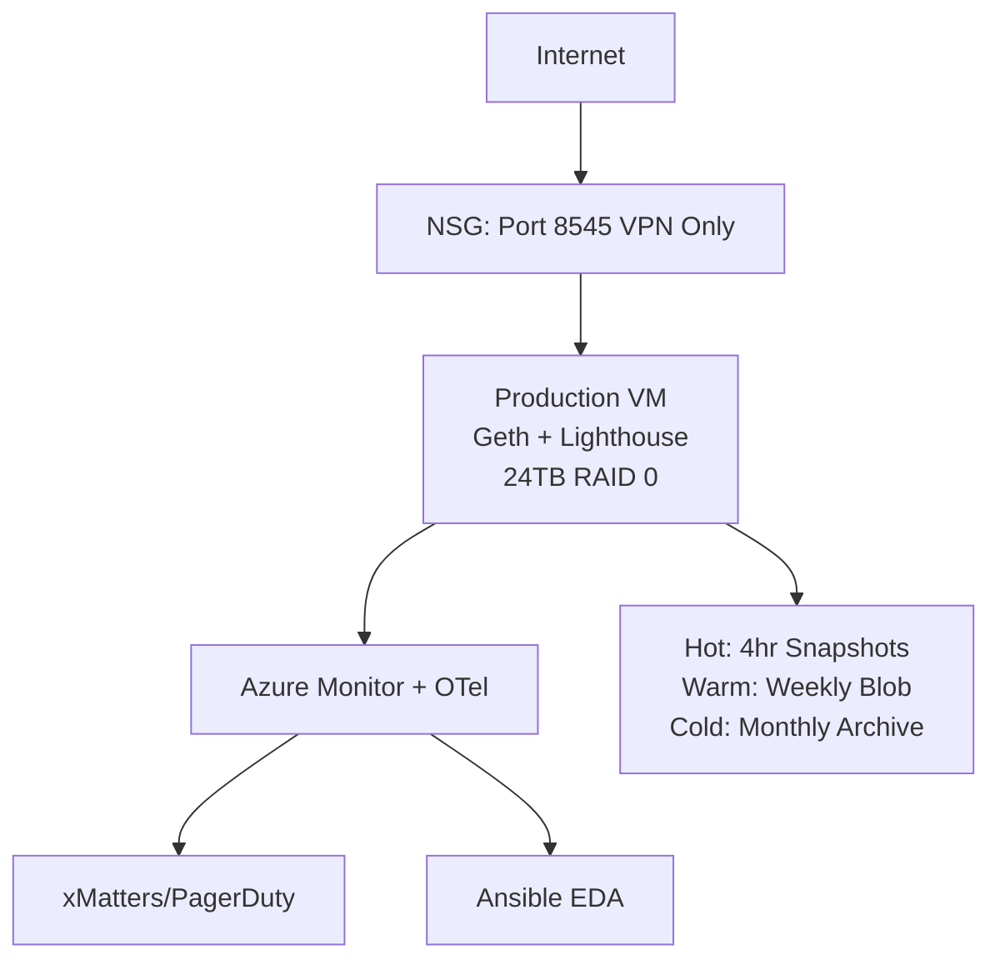

# Ethereum Archive Node: Production Operational Plan

**Infrastructure**: Single Azure VM (Lsv3-series, 80 vCPU, 640GB RAM) | **Storage**: RAID 0 (3x 8TB Premium SSD v2, 24TB usable) | **Cost**: ~$4,400/month | **SLO**: 99.9% availability

---

## 1. Architecture Overview

### Compute & Storage
- **VM**: Lsv3-series on Ubuntu 22.04 LTS with kernel tuning
- **Storage**: RAID 0 (3x 8TB Premium SSD v2 = 240,000 IOPS) configured via Linux mdadm
  - **Rationale**: Azure LRS already provides 3 replicas; RAID 0 maximizes performance + capacity
  - **4-hourly snapshots** provide 30-min RTO; can migrate to RAID 5/6 post-testing if needed
- **HA Strategy**: 99.9% SLO (43 min/month downtime); monthly compaction window (first Sat, 2-8 AM UTC)

### Infrastructure Architecture

---

## 2. DevOps Pipeline

**CI/CD (GitHub Actions)**: Binary acquisition → Artifactory → Xray CVE scan → Terraform provision → Ansible deploy → health validation

**IaC (Terraform)**: VNet, NSGs, VM (Azure Managed Identity), Premium SSD v2 disks, Key Vault

**Config (Ansible Playbooks)**: `bootstrap.yml`, `deploy_binaries.yml`, `configure_services.yml`, `patch_security.yml`, `compact_scheduled.yml`

**Secrets**: HashiCorp Vault (JWT, SSH keys, SP creds); VMs auth via Managed Identity

---

## 3. Security

- **Access**: SSH hardening (key-only, no root, fail2ban), Azure Bastion (no public IPs), RBAC (least privilege)
- **Network**: NSGs (default deny), RPC via Private Link/VPN only, DDoS Protection Standard, peer restriction (`--netrestrict`)
- **Binary Supply Chain**: Artifactory + Xray CVE scanning blocks high-severity vulnerabilities
- **Audit**: Azure Security Center, auditd (SSH/file access logs), immutable Log Analytics (7-year retention), Azure Sentinel SIEM
- **Data**: Disk encryption at rest, backup verification (quarterly DR drills + checksums), Terraform state in Azure Storage (locked)

---

## 4. Monitoring & Observability

**Metrics**: OTel Collector → Azure Monitor + Prometheus (Geth `:6060`, Lighthouse `:5054`, Node Exporter, Systemd Exporter)

**Traces**: OpenTelemetry on JSON-RPC requests → Application Insights (indexed by `block_number`, `tx_hash`, `method`)

**Dashboards**: Grafana (Azure Monitor + Prometheus data sources); panels for block height, query p99 latency, disk usage, peer count

**Alerting**:
- **Critical** (PagerDuty): Node down >5 min, disk >85%, sync stalled >1 hr, query p99 >10s
- **Warning** (Slack): CPU >80%, peers <20, memory >90%

**Self-Healing**: Ansible EDA listens to Azure Monitor webhooks → auto-executes remediation playbooks (restart services, clear caches, reset peers)

---

## 5. Disaster Recovery & Backups

**3-Tier Strategy**:
1. **Hot**: Azure disk snapshots (every 4 hours, 7-day retention, 30-min RTO) - $40/month
2. **Warm**: Weekly Azure Blob backups (Hot tier, 4-week retention, 8-hr RTO) - $250/month
3. **Cold**: Monthly Azure Blob (Archive tier, 12-month retention, 24-48 hr RTO) - $12/month

**Geographic Redundancy**: Primary + DR; Terraform provisions DR VM, restores from Warm backup, updates DNS; RPO: 7 days

**Validation**: Quarterly DR drills, checksum validation post-backup

---

## 6. Operations

### Compaction (Scheduled Maintenance)
**Trigger**: Disk fragmentation >20% OR first Saturday monthly

**Process** (Ansible `compact_scheduled.yml`):
1. Email users 48 hrs ahead → post to status page
2. Stop services → run `geth snapshot prune-state` (4-6 hrs) → restart
3. Sync verification (~30 min) → clear maintenance notice
4. **Downtime**: 5-7 hrs total (within 99.9% SLO)

### Patching
- **Security**: Ansible `patch_security.yml` applies security-only patches; reboots during compaction window
- **Azure Update Manager**: Centralized compliance reporting
- **Client Upgrades**: Geth/Lighthouse updates via Artifactory → Xray scan → deploy in maintenance window

---

## 7. Cost Management

**FinOps**: Reserved Instances (40% savings), Azure Cost Management budget alerts, storage tiering

**Green SRE**: Carbon-aware compaction scheduling, quarterly right-sizing reviews, Redis caching to reduce redundant RPC calls

---

## 8. Critical Success Factors

**For Archive Nodes**:
1. **Query Speed**: Premium SSD v2 RAID 0 (240,000 IOPS), Application Insights indexed traces
2. **Storage Capacity**: 24TB RAID 0 with capacity monitoring (14-16TB required in 2025)
3. **Availability**: RAID 0 + Azure LRS, automated snapshots, self-healing automation, DR failover

**Acceptable Downtime**: Scheduled monthly compaction (users notified 48 hrs ahead), service restarts (<1 min via systemd)

---

## 9. SRE Culture

**Deployment**: One-click via GitHub Actions (Terraform + Ansible); immutable infrastructure; everything-as-code

**On-Call**: 24/7 PagerDuty (only unresolvable failures); blameless postmortems; 99.9% SLO = 43 min/month error budget

**Continuous Improvement**: Quarterly DR (failure simulation), metrics reviews (latency trends), FinOps dashboards

